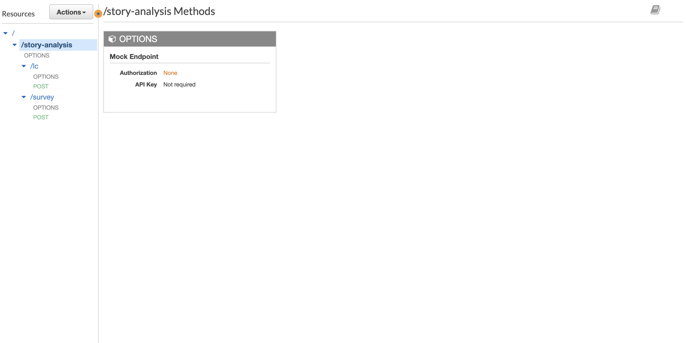
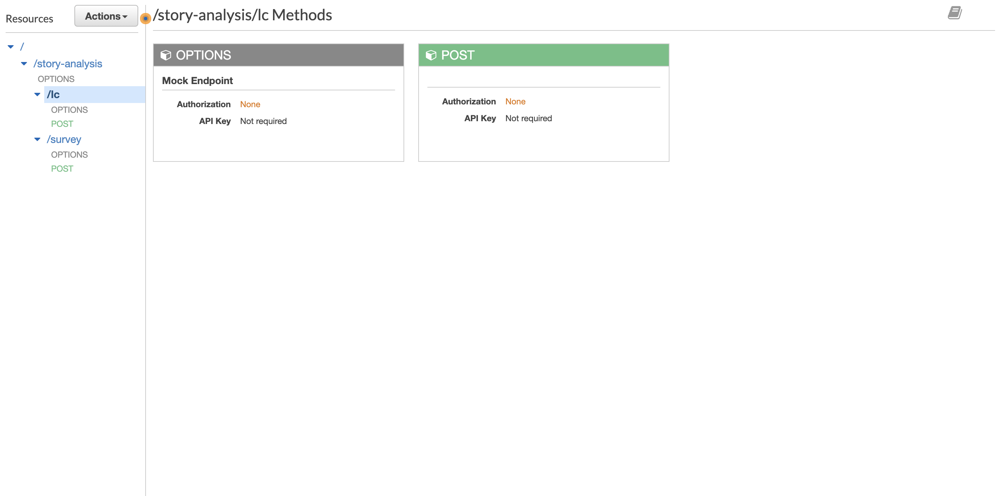
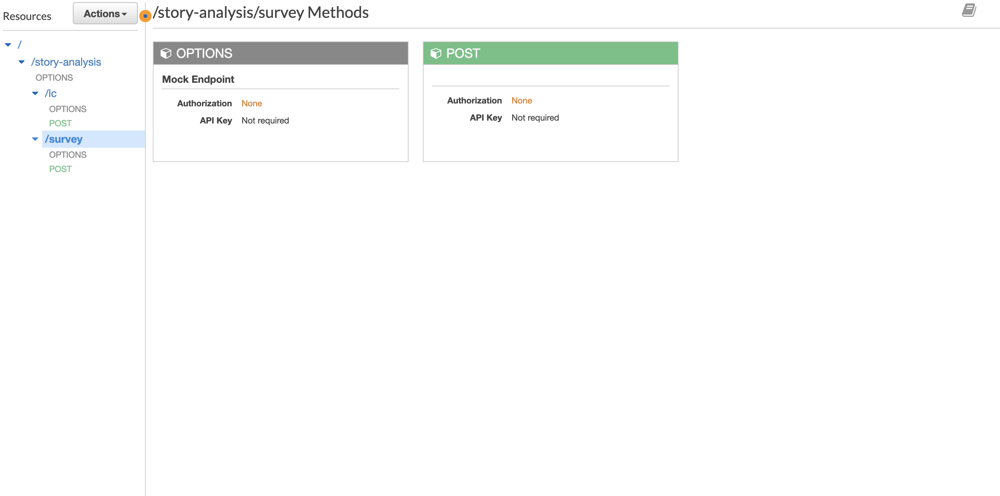

# Story survey api

Setup Instruction

1. Setup AWS CLI locally with IAM user with the required permissions.
2. Setup dependent lambda layer. Setup [story-analysis-layers](https://github.com/ishrat2003/story-analysis-layers) project localy and run the following script inside the project to upload required packages. 
    ```sh
    $ cd story-analysis-layers
    $ ./scripts/install.sh -p 3.8 -u yes -l StoryLayer
    ```
2. Run the following script to setup dynamodb in AWS.
    ```sh
    $ ./scripts/dynamodb/seed.sh -e production
    ```

3. Setup S3 bucket in AWS. We have created a bucket name "sam-story-analysis". Update S3_LAMBDA_BUCKET and other necessary script variables in /scripts/deploy/common.sh. Execute the following script to create lambda functions for LC and Survey.
    ```sh
    $ ./scripts/deploy/create/lambda.sh
    ```
    After creation to update lambda run the following script.
    ```sh
    $ ./scripts/deploy/update/lambda.sh
    ```
4. Setup the following environment variables for the LC lambda.
    ```sh
    ENVIRONMENT_NAME: "production"
    GOOGLE_KNOWLEDGE_GRAPH: "YOUR_GOOGLE_KNOWLEDGE_GRAPH_KEY"
    ```
5. Setup the following environment variables for the Survey lambda.
    ```sh
    ENVIRONMENT_NAME: "production"
    DYNAMODB_ENDPOINT: "https://dynamodb.eu-west-1.amazonaws.com"
    DEFAULT_DYNAMODB_ENDPOINT: "http://host.docker.internal:8000"
    TABLE_NAME: "localstoryreview"
    ```
6. Setup API Gateway and endpoints for LC and Survey in AWS admin.
<div style='float: center'>
  </img>
</div>
<div style='float: center'>
  </img>
</div>
<div style='float: center'>
  </img>
</div>

7. To test using [Postman](https://www.postman.com/). Import the collection from [here](./docs/api.postman_collection.json). Add the following postman environment variables.
    ```sh
    API_URL http://127.0.0.1:3500
    GOOGLE_KNOWLEDGE_GRAPH "YOUR_GOOGLE_KNOWLEDGE_GRAPH_KEY"
    ```
